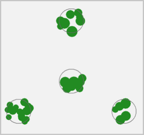

<!-- README.md is generated from README.Rmd. Please edit that file -->

```{r, include = FALSE}
knitr::opts_chunk$set(
  collapse = TRUE,
  comment = "#>",
  fig.path = "man/figures/README-",
  fig.width = 7, fig.height = 7,
  out.width = "70%"
)
```

# FIAstemmap <a href="https://ctoney.github.io/FIAstemmap/"></a>

<!-- badges: start -->
[](https://github.com/ctoney/FIAstemmap/actions/workflows/R-CMD-check.yaml)
<!-- badges: end -->

**NOTE: this is an implementation update _currently under development_**

The Forest Inventory and Analysis Program ([FIA](https://research.fs.usda.gov/programs/nfi)) of USDA Forest Service provide tree-level measurements from a systematic grid of field plots across all forest ownerships and land uses in the US.

**FIAstemmap** is an R package for mapping tree stem locations on FIA plots, modeling individual crown dimensions, and generating plot-level estimates of fractional tree canopy cover. Several stand height metrics can also be calculated. Spatial analysis of tree point pattern is facilitated for the standard FIA four-point cluster plot design. Efficient data processing is intended to support national applications. The package provides an updated implementation of the software originally described by Toney et al. 2009 [[1]](#references). The original implementation for predicting canopy cover from individual tree measurements has supported several applications of FIA data, including:

* LANDFIRE vegetation classification and tree canopy cover mapping [[2, 3, 4, 5]](#references)
* National Land Cover Database (NLCD) Tree Canopy Cover science and development [[6, 7]](#references)
* wildlife habitat analysis [[8, 9, 10]](#references)
* mapping erosion risk [[11]](#references)
* assessment of tree canopy cover estimation methods [[12, 13]](#references)

Note that analysis or computation based on tree spatial pattern within a plot require input data with coordinates of individual stems given as aziumuth and distance from the sample center point. FIA no longer provide `AZIMUTH` and `DIST` attributes in the publicly available FIADB `TREE` table. The FIADB User Guide states that these attributes are now available by request from [FIA Spatial Data Services](https://research.fs.usda.gov/programs/fia/sds) [[14]](#references). Tree data without stem locations can be used in **FIAstemmap** with reduced functionality which includes predicting individual tree crown width and computing several stand structure metrics.

## Installation

You can install the development version of **FIAstemmap** with:

``` r
# install.packages("pak")
pak::pak("ctoney/FIAstemmap")
```

## Examples

### Predict crown width

The data frame `cw_coef` provides a curated set of linear regression coefficients for predicting crown width from stem diameter of tree species in the conterminous US. The crown width prediction method also addresses potential issues in cases of extrapolation beyond the range of the model fitting data. Details are given in the documentation for `calc_crwidth()`. Input is a data frame of tree records which must have columns `SPCD` (FIA integer species code), `STATUSCD` (FIA integer tree status code, `1` = live) and `DIA` (FIA tree diameter in inches), here using the `plantation` example tree list.

```{r predict-crwidth}
library(FIAstemmap)

# regression coefficients for estimating tree crown width from diameter
head(cw_coef)

# add predicted crown widths to the plantation tree list
# `within()` to modify only a copy of the example dataset
tree_list <- within(plantation, CRWIDTH <- calc_crwidth(plantation))
str(tree_list)
```

### Exploratory analysis

Plot-level visualization and other exploratory analyses require input data with stem locations provided in columns `AZIMUTH` (horizontal angle from subplot/microplot center to the stem location, in range `0:359`) and `DIST` (stem distance from subplot/microplot center).

```{r plot-crowns}
# display modeled tree crowns projected vertically on the FIA plot boundary
plot_crowns(tree_list, main = "plantation plot")

# individual subplot
plot_crowns(tree_list, subplot = 4, main = "plantation subplot 4")

# or microplot
plot_crowns(tree_list, subplot = 4, microplot = TRUE,
            main = "plantation microplot 4")
```

Helper functions are provided to facilitate analyzing FIA tree lists as Spatial Point Patterns using the **spatstat** library. `create_fia_ppp()` returns an object of class `"ppp"` representing the point pattern of an FIA tree list in the 2-D plane. This object can be used with functions of package **spatstat.explore** for additional plotting capabilty, computation of descriptive spatial statistics, and other exploratory data analysis.

```{r spatstat-explore}
# point pattern object for the plantation tree list
X <- create_fia_ppp(plantation)
summary(X)

plot(X, pch = 16, background = "gray90", main = "Loblolly pine plantation")

# compute Ripley's K-function applying isotropic edge correction
K <- spatstat.explore::Kest(X, rmax = 12, correction = "isotropic")

# plot estimated K(r) along with theoretical values for a random (Poisson)
# point process, suggests spatial regularity in this case
plot(K, main = "Ripley's K for the plantation trees")
```

### Compute stand structure metrics


### Data processing


## References

[1] Toney, Chris; Shaw, John D.; Nelson, Mark D. 2009. A stem-map model for predicting tree canopy cover of Forest Inventory and Analysis (FIA) plots. In: McWilliams, Will; Moisen, Gretchen; Czaplewski, Ray, comps. _Forest Inventory and Analysis (FIA) Symposium 2008_; October 21-23, 2008; Park City, UT. Proc. RMRS-P-56CD. Fort Collins, CO: U.S. Department of Agriculture, Forest Service, Rocky Mountain Research Station. 19 p. Available: https://research.fs.usda.gov/treesearch/33381.

[2] LANDFIRE: LANDFIRE Existing Vegetation Cover layer. (LF2024 version released 2025 - last update). U.S. Department of Interior, Geological Survey, and U.S. Department of Agriculture. [Online]. Available: https://landfire.gov/vegetation/evc [accessed 2026, Feb 24].

[3] Moore, Annabelle; La Puma, Inga; Dillon, Greg; Smail, Tobin; Schleeweis, Karen; Toney, Chris; Menakis, Jim; Bastian, Henry; Picotte, Josh; Dockter, Daryn; Tolk, Brian. 2024. Twenty years of science and management with LANDFIRE. Connected Science, October 2024. Fort Collins, CO: U.S. Department of Agriculture, Forest Service, Rocky Mountain Research Station. 2 p. Available: https://research.fs.usda.gov/treesearch/68397.

[4] Vogelmann, Jim & Kost, Jay & Tolk, Brian & Howard, Stephen & Short, Karen & Chen, Xuexia & Huang, Chengquan & Pabst, Kari & Rollins, Matthew. (2011). Monitoring Landscape Change for LANDFIRE Using Multi-Temporal Satellite Imagery and Ancillary Data. _Selected Topics in Applied Earth Observations and Remote Sensing, IEEE Journal of_. 4. 252-264. 10. https://doi.org/10.1109/JSTARS.2010.2044478.

[5] Nelson, K.J., Connot, J., Peterson, B. et al. 2013. The LANDFIRE Refresh Strategy: Updating the National Dataset. _Fire Ecology_, 9, 80-101, https://doi.org/10.4996/fireecology.0902080.

[6] Toney, Chris; Liknes, Greg; Lister, Andy; Meneguzzo, Dacia. 2012. Assessing alternative measures of tree canopy cover: Photo-interpreted NAIP and ground-based estimates. In: McWilliams, Will; Roesch, Francis A. eds. 2012. _Monitoring Across Borders: 2010 Joint Meeting of the Forest Inventory and Analysis (FIA) Symposium and the Southern Mensurationists_. e-Gen. Tech. Rep. SRS-157. Asheville, NC: U.S. Department of Agriculture, Forest Service, Southern Research Station. 209-215. Available: https://research.fs.usda.gov/treesearch/41009.

[7] Derwin, J.M., Thomas, V.A., Wynne, R.H., Coulston, J.W., Liknes, G.C., Bender, S., Blinn, C.E., Brooks, E.B., Ruefenacht, B., Benton, R. and Finco, M.V., 2020. Estimating tree canopy cover using harmonic regression coefficients derived from multitemporal Landsat data. _International Journal of Applied Earth Observation and Geoinformation_, 86, 101985, https://doi.org/10.1016/j.jag.2019.101985.

[8] Tavernia, B., Nelson, M., Goerndt, M., Walters, B., & Toney, C. (2013). Changes in forest habitat classes under alternative climate and land-use change scenarios in the northeast and midwest, USA. _Mathematical and Computational Forestry & Natural-Resource Sciences_ (MCFNS), 5:2, 135-150. Retrieved from https://www.mcfns.com/index.php/Journal/article/view/MCFNS_165.

[9] Rowland, M.M.; Vojta, C.D.; tech. eds. 2013. A technical guide for monitoring wildlife habitat. Gen. Tech. Rep. WO-89. Washington, DC: U.S. Department of Agriculture, Forest Service: 400 p. Available: https://doi.org/10.2737/WO-GTR-89.

[10] Michael C. McGrann, Bradley Wagner, Matthew Klauer, Kasia Kaphan, Erik Meyer, Brett J. Furnas. 2022. Using an acoustic complexity index to help monitor climate change effects on avian diversity.
_Ecological Indicators_, Volume 142, 109271, https://doi.org/10.1016/j.ecolind.2022.109271.

[11] McGwire KC, Weltz MA, Nouwakpo S, Spaeth K, Founds M, Cadaret E. 2020. Mapping erosion risk for saline rangelands of the Mancos Shale using the rangeland hydrology erosion model. _Land Degradation & Development_. 31: 2552-2564, https://doi.org/10.1002/ldr.3620.

[12] Riemann, R., Liknes, G., O'Neil-Dunne, J., Toney, C., Lister, T. (2016). Comparative assessment of methods for estimating tree canopy cover across a rural-to-urban gradient in the mid-Atlantic region of the USA. _Environmental Monitoring and Assessment_, 188, 297, https://doi.org/10.1007/s10661-016-5281-8.

[13] Andrew N. Gray, Anne C.S. McIntosh, Steven L. Garman, Michael A. Shettles. 2021. Predicting canopy cover of diverse forest types from individual tree measurements. _Forest Ecology and Management_, Volume 501, 119682, ISSN 0378-1127, https://doi.org/10.1016/j.foreco.2021.119682.

[14] Burrill, Elizabeth A.; DiTommaso, Andrea M.; Turner, Jeffery A.; Pugh, Scott A.; Christensen, Glenn; Kralicek, Karin M.; Perry, Carol J.; Lepine, Lucie C.; Walker, David M.; Conkling, Barbara L. 2024. The Forest Inventory and Analysis Database, FIADB user guides, volume: database description (version 9.4), nationwide forest inventory (NFI). U.S. Department of Agriculture, Forest Service. 1016 p. [Online]. Available at: https://research.fs.usda.gov/understory/forest-inventory-and-analysis-database-user-guide-nfi.
