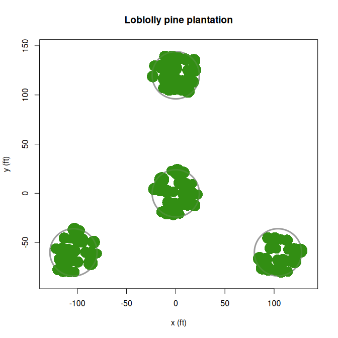
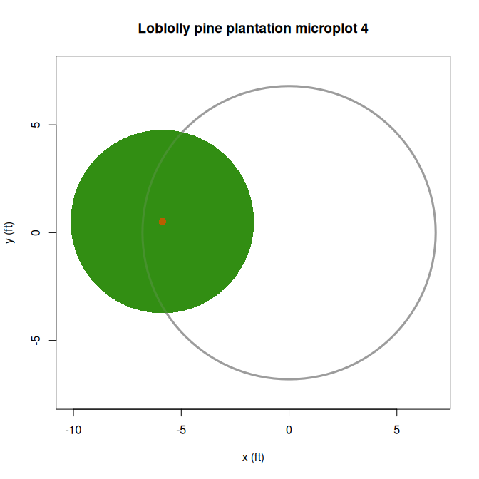
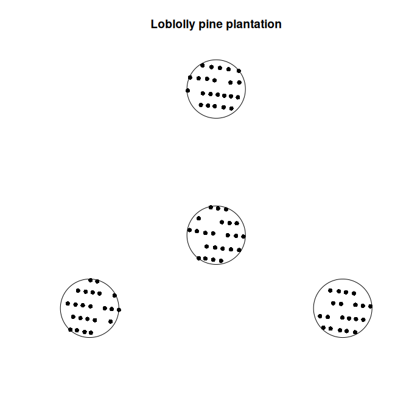
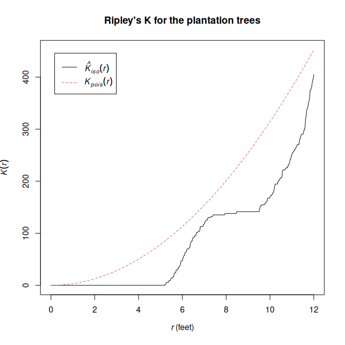
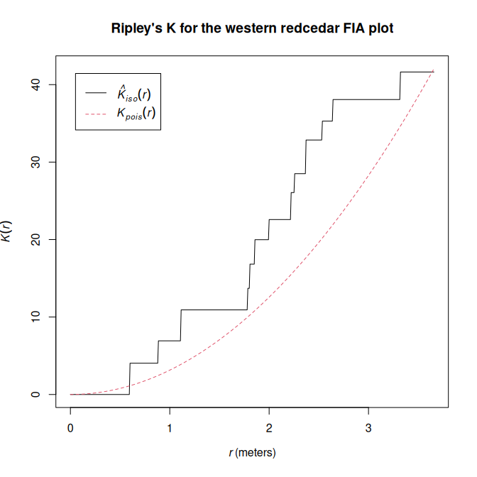

<!-- README.md is generated from README.Rmd. Please edit that file -->

# FIAstemmap <a href="https://firelab.github.io/FIAstemmap/"></a>

<!-- badges: start -->

[](https://github.com/firelab/FIAstemmap/actions/workflows/R-CMD-check.yaml)
<!-- badges: end -->

**NOTE: this is an implementation update *currently under development***

The Forest Inventory and Analysis Program
([FIA](https://research.fs.usda.gov/programs/nfi)) of USDA Forest
Service provide tree-level measurements from a systematic grid of field
plots across all forest ownerships and land uses in the US.

**FIAstemmap** is an R package for mapping tree stem locations on FIA
plots, modeling individual crown dimensions, and generating plot-level
estimates of fractional tree canopy cover. Several stand height metrics
can also be calculated. Spatial analysis of tree point pattern is
facilitated for the standard FIA four-point cluster plot design.
Efficient data processing is intended to support national applications.
The package provides an updated implementation of the software
originally described by Toney et al. 2009 [\[1\]](#references). The
original implementation for predicting canopy cover from individual tree
measurements has supported several applications of FIA data, including:

- LANDFIRE vegetation classification and tree canopy cover mapping [\[2,
  3, 4, 5\]](#references)
- National Land Cover Database (NLCD) Tree Canopy Cover science and
  development [\[6, 7\]](#references)
- wildlife habitat analysis [\[8, 9, 10\]](#references)
- mapping erosion risk [\[11\]](#references)
- assessment of tree canopy cover estimation methods [\[12,
  13\]](#references)

Computations based on tree spatial pattern within a plot require input
data with coordinates of the individual stems given as azimuth and
distance from the sample center point. Note that FIA no longer provide
the `AZIMUTH` and `DIST` attributes in the publicly available `TREE`
table. The FIADB User Guide [\[14\]](#references) states that these
attributes are now available by request from [FIA Spatial Data
Services](https://research.fs.usda.gov/programs/fia/sds).

Tree data lacking stem locations can still be used with **FIAstemmap**
for certain functionality, which includes predicting individual tree
crown width and computing several stand structure metrics. The latter
includes the option to estimate plot-level tree canopy cover using the
aspatial “FVS” method [\[15\]](#references) which assumes a random
arrangement of the crowns.

## Installation

You can install the development version of **FIAstemmap** with:

``` r
# install.packages("pak")
pak::pak("firelab/FIAstemmap")
```

## Examples

### Predict tree crown width

The data frame `cw_coef` contains a curated set of linear regression
coefficients for predicting crown width from stem diameter of tree
species in the conterminous US (see `?cw_coef`). The method for crown
width prediction attempts to avoid extrapolation beyond the range of the
model fitting data by providing reasonable fall backs for the obvious
cases. Details are given in the documentation for `calc_crwidth()`.

The input is a data frame of tree records which must have columns `SPCD`
(FIA species code), `STATUSCD` (FIA tree status code, `1` = live) and
`DIA` (FIA tree diameter). FIA distribute data in [United States
customary
units](https://en.wikipedia.org/wiki/United_States_customary_units) with
tree diameter given in inches, height in feet, and area in acres.
Convenience functions are provided for converting to and from SI
units[<sup>1</sup>](#footnotes) (`in_to_cm()`, `cm_to_in()`,
`ft_to_m()`, `m_to_ft()`, `ac_to_ha()`, `ha_to_ac()`).

The `plantation` dataset used here is an example tree list included in
the package.

``` r
library(FIAstemmap)

# Regression coefficients for estimating crown width from diameter are included.
# See `?cw_coef`.
head(cw_coef)
#>   symbol SPCD        common_name surrogate   b0   b1    b2          reference
#> 1   ABAM   11 Pacific silver fir      <NA> 7.30 0.59  0.00    Bechtold (2004)
#> 2   ABCO   15          white fir      <NA> 4.49 0.92 -0.01    Bechtold (2004)
#> 3   ABGR   17          grand fir      <NA> 5.75 1.11 -0.01    Bechtold (2004)
#> 4  ABLAA   18       corkbark fir      <NA> 6.07 0.37  0.00    Bechtold (2004)
#> 5   ABLA   19      subalpine fir      <NA> 3.96 0.64  0.00    Bechtold (2004)
#> 6   ABMA   20 California red fir      <NA> 6.67 0.43  0.00 Gill et al. (2000)

# Add a column of predicted crown widths to the `plantation` tree list.
# The base R function `within()` modifies a copy of the example dataset.
tree_list <- within(plantation, CRWIDTH <- calc_crwidth(plantation))
str(tree_list)
#> 'data.frame':    91 obs. of  13 variables:
#>  $ PLT_CN   : chr  "601960719718" "601960719718" "601960719718" "601960719718" ...
#>  $ SUBP     : int  1 1 1 1 1 1 1 1 1 1 ...
#>  $ TREE     : int  4 1 2 3 5 6 10 7 8 9 ...
#>  $ AZIMUTH  : int  21 282 185 4 24 48 93 60 90 92 ...
#>  $ DIST     : num  22.7 9.1 10.1 22 11.7 14.9 22.4 19.5 9.5 16.3 ...
#>  $ STATUSCD : int  1 1 1 1 1 1 1 1 1 1 ...
#>  $ SPCD     : int  131 131 131 131 131 131 131 131 131 131 ...
#>  $ DIA      : num  6.8 7.6 6 9.6 8.1 6 5.5 5.2 9.2 8.2 ...
#>  $ HT       : num  42 44 41 50 45 45 40 43 47 49 ...
#>  $ ACTUALHT : num  42 44 41 50 45 45 40 43 47 49 ...
#>  $ CCLCD    : int  3 3 3 3 3 3 3 3 3 3 ...
#>  $ TPA_UNADJ: num  6.02 6.02 6.02 6.02 6.02 ...
#>  $ CRWIDTH  : num  11.9 13 10.8 15.8 13.7 10.8 10.2 9.7 15.3 13.9 ...
```

### Exploratory analysis

Plot-level visualization and other exploratory analyses require input
data with individual stem locations given in columns named `AZIMUTH`
(horizontal angle from subplot/microplot center, `0:359`) and `DIST`
(distance from subplot/microplot center).

``` r
# Display modeled tree crowns projected vertically on the FIA plot boundary.
plot_crowns(tree_list, main = "Loblolly pine plantation")
```



``` r

# Individual subplot
plot_crowns(tree_list, subplot = 4,
            main = "Loblolly pine plantation subplot 4")
```


``` r

# Or microplot
plot_crowns(tree_list, subplot = 4, microplot = TRUE,
            main = "Loblolly pine plantation microplot 4")
```



Helper functions facilitate the analysis of FIA tree lists as spatial
point patterns using the **spatstat** library. `create_fia_ppp()`
returns an object of class `"ppp"` representing the point pattern of an
FIA tree list in the 2-D plane. This object can be used with functions
of
[**spatstat.explore**](https://cran.r-project.org/package=spatstat.explore)
which provide additional plotting capabilities, descriptive spatial
statistics, and other exploratory data analysis.

``` r
## Create a spatstat point pattern object for the pine plantation tree list.
X <- create_fia_ppp(plantation)
summary(X)
#> Planar point pattern:  89 points
#> Average intensity 0.01229542 points per square foot
#> 
#> Coordinates are given to 16 decimal places
#> 
#> Window: polygonal boundary
#> 4 separate polygons (no holes)
#>            vertices    area relative.area
#> polygon 1       360 1809.62          0.25
#> polygon 2       360 1809.62          0.25
#> polygon 3       360 1809.62          0.25
#> polygon 4       360 1809.62          0.25
#> enclosing rectangle: [-127.921, 127.921] x [-84.001, 144.001] feet
#>                      (255.8 x 228 feet)
#> Window area = 7238.47 square feet
#> Unit of length: 1 foot
#> Fraction of frame area: 0.124

plot(X, pch = 16, background = "#fdf6e3",
     main = "Pine plantation point pattern")
```



``` r

# Compute Ripley's K-function applying isotropic edge correction.
K <- spatstat.explore::Kest(X, rmax = 12, correction = "isotropic")

# Plot estimated K(r) along with theoretical values for a random point process,
# suggesting spatial regularity in this case.
plot(K, main = "Ripley's K for the plantation FIA plot")
```



The `western_redcedar` dataset is another example tree list included in
the package. The following code uses meter for the distance unit.

``` r
## Spatial point pattern for the western redcedar tree list.

# Give stem distances in meters.
trees <- within(western_redcedar, DIST <- ft_to_m(DIST))

X <- create_fia_ppp(trees, linear_unit = "m")
summary(X)
#> Planar point pattern:  24 points
#> Average intensity 0.03568904 points per square meter
#> 
#> Coordinates are given to 15 decimal places
#> 
#> Window: polygonal boundary
#> 4 separate polygons (no holes)
#>            vertices    area relative.area
#> polygon 1       360 168.119          0.25
#> polygon 2       360 168.119          0.25
#> polygon 3       360 168.119          0.25
#> polygon 4       360 168.119          0.25
#> enclosing rectangle: [-38.99032, 38.99032] x [-25.6035, 43.8915] meters
#>                      (77.98 x 69.5 meters)
#> Window area = 672.475 square meters
#> Unit of length: 1 meter
#> Fraction of frame area: 0.124

plot(X, pch = 16, background = "#fdf6e3",
     main = "Western redcedar point pattern")
```


``` r

K <- spatstat.explore::Kest(X, rmax = ft_to_m(12), correction = "isotropic")

plot(K, main = "Ripley's K for the western redcedar FIA plot")
```



### Compute stand structure metrics

``` r
## Compute fractional tree canopy cover of a specific sampled area by overlaying
## modeled crowns.

# Subplot 1 of the plantation plot (subplot radius 24 ft).
# Omit saplings which are only sampled in the microplot.
# Visualized with: `plot_crowns(tree_list, subplot = 1)`
tree_list[tree_list$SUBP == 1 & tree_list$DIA >= 5, ] |>
  calc_crown_overlay(sample_radius = 24)
#> [1] 86.8

## Calculate stand height metrics, which are also included by default in the
## output of `calc_tcc_metrics()` (see below).

# Compute stand height metrics only.
# calc_ht_metrics(plantation)

## Predict plot-level canopy cover from individual tree measurements.

# By default, TCC is predicted using the "stem-map" model, full output returned.
calc_tcc_metrics(plantation)
#> $model_tcc
#> [1] 88.4
#> 
#> $subp1_crown_overlay
#> [1] 86.8
#> 
#> $subp2_crown_overlay
#> [1] 91.7
#> 
#> $subp3_crown_overlay
#> [1] 80.2
#> 
#> $subp4_crown_overlay
#> [1] 87.2
#> 
#> $subp_overlay_mean
#> [1] 86.475
#> 
#> $micr1_crown_overlay
#> [1] 0
#> 
#> $micr2_crown_overlay
#> [1] 0
#> 
#> $micr3_crown_overlay
#> [1] 20.2
#> 
#> $micr4_crown_overlay
#> [1] 22.5
#> 
#> $micr_overlay_mean
#> [1] 10.675
#> 
#> $L_6ft
#> [1] 3.868305
#> 
#> $L_8ft
#> [1] 6.627377
#> 
#> $L_10ft
#> [1] 7.300455
#> 
#> $L_12ft
#> [1] 11.35045
#> 
#> $numTrees
#> [1] 89
#> 
#> $meanTreeHt
#> [1] 44.8
#> 
#> $meanTreeHtBAW
#> [1] 45.3
#> 
#> $meanTreeHtDom
#> [1] 44.8
#> 
#> $meanTreeHtDomBAW
#> [1] 45.3
#> 
#> $maxTreeHt
#> [1] 51
#> 
#> $predomTreeHt
#> [1] 50.7
#> 
#> $numSaplings
#> [1] 2
#> 
#> $meanSapHt
#> [1] 34.5
#> 
#> $maxSapHt
#> [1] 43

# Return only the predicted TCC value (`$model_tcc`).
calc_tcc_metrics(plantation, full_output = FALSE)
#> [1] 88.4

# Alternatively, use the "FVS method" which assumes a random arrangement of
# tree crowns. This method does not require individual stem coordinates.
calc_tcc_metrics(plantation, stem_map = FALSE, full_output = FALSE)
#> [1] 81.4
```

### Data processing

``` r
# Load tree data from a file or database connection.
# Lolo NF, single-condition forested plots, INVYR = 2022, from public FIADB
f <- system.file("extdata/mt_lnf_2022_1cond_tree.csv", package="FIAstemmap")
tree_table <- load_tree_data(f)
#> ! The data source does not have DIST and/or AZIMUTH.
#> ℹ Fetching tree data
#> ✔ Fetching tree data [14ms]
#> 
#> ℹ 910 tree records returned.

head(tree_table)
#>            PLT_CN SUBP TREE STATUSCD SPCD DIA HT ACTUALHT CCLCD TPA_UNADJ
#> 1 670951075126144    1    1        2  108  NA NA       NA    NA        NA
#> 2 670951075126144    1    2        1  108   1  9        9     3  74.96528
#> 3 670951075126144    2    1        2  108  NA NA       NA    NA        NA
#> 4 670951075126144    2    2        2  108  NA NA       NA    NA        NA
#> 5 670951075126144    2    3        2  108  NA NA       NA    NA        NA
#> 6 670951075126144    2    4        2  108  NA NA       NA    NA        NA

process_tree_data(tree_table, stem_map = FALSE, full_output = TRUE)
#> ℹ The input table contains tree data for 22 plots.
#>             PLT_CN model_tcc numTrees meanTreeHt meanTreeHtBAW meanTreeHtDom
#> 1  670951075126144       1.2        0        0.0           0.0           0.0
#> 2  670950940126144      38.4       24       61.4          66.4          64.5
#> 3  670950992126144       3.4        1       43.0          43.0          43.0
#> 4  670950609126144      17.2        4      102.2         102.6         102.2
#> 5  670950600126144      34.9       16       62.1          79.0          69.9
#> 6  670951118126144      20.6        9       24.6          28.0          30.0
#> 7  670950964126144      37.9       16       58.8          67.1          64.1
#> 8  670951031126144      51.2       29       70.2          72.8          72.4
#> 9  670950608126144      70.8       32       73.7          94.8          86.6
#> 10 670950599126144      66.4       44       61.8          66.4          64.1
#> 11 670950967126144      57.4       23       86.0         100.7          96.1
#> 12 670950732126144      34.4       12       64.3          91.8          72.6
#> 13 670950725126144      66.5       69       66.3          87.0          73.9
#> 14 670950598126144      55.8       20       65.7          89.6          83.9
#> 15 670950965126144      81.3       74       53.1          55.1          54.5
#> 16 670951032126144      32.5        5       15.0          14.2          15.0
#> 17 670951034126144      16.4        7       40.7          45.0          40.7
#> 18 670950625126144      44.5       23       42.0          61.9          42.9
#> 19 670951029126144      55.1       33       64.7          68.5          64.7
#> 20 670951035126144      97.6       54       44.9          50.6          45.7
#> 21 670951089126144      21.1        7       79.9          83.0          79.9
#> 22 670951152126144       5.3        3       21.3          21.7          21.3
#>    meanTreeHtDomBAW maxTreeHt predomTreeHt numSaplings meanSapHt maxSapHt
#> 1               0.0         0          0.0           1       9.0        9
#> 2              67.9        85         81.7           1      16.0       16
#> 3              43.0        43         43.0           0       0.0        0
#> 4             102.6       114        106.3           0       0.0        0
#> 5              83.4       104         99.3           0       0.0        0
#> 6              34.8        47         39.7           0       0.0        0
#> 7              69.0        80         78.0           0       0.0        0
#> 8              73.6        85         83.0           0       0.0        0
#> 9              98.3       120        112.7          19      15.8       38
#> 10             67.2        84         81.7           1      14.0       14
#> 11            103.7       123        117.0           2      13.0       16
#> 12             94.2       109         93.7           0       0.0        0
#> 13             89.6       118        116.3           2      12.5       16
#> 14             97.3       128        112.0           5      11.4       18
#> 15             56.1        72         67.0           3      40.3       45
#> 16             14.2        22         18.3          15      12.3       20
#> 17             45.0        53         48.3           0       0.0        0
#> 18             63.0       104         70.0           2      20.5       25
#> 19             68.5        87         83.3           3      19.0       22
#> 20             51.2        74         66.0          27      23.5       39
#> 21             83.0        92         85.3           0       0.0        0
#> 22             21.7        24         21.3           1      14.0       14
```

## References

\[1\] Toney, Chris; Shaw, John D.; Nelson, Mark D. 2009. A stem-map
model for predicting tree canopy cover of Forest Inventory and Analysis
(FIA) plots. In: McWilliams, Will; Moisen, Gretchen; Czaplewski, Ray,
comps. *Forest Inventory and Analysis (FIA) Symposium 2008*; October
21-23, 2008; Park City, UT. Proc. RMRS-P-56CD. Fort Collins, CO: U.S.
Department of Agriculture, Forest Service, Rocky Mountain Research
Station. 19 p. Available:
<https://research.fs.usda.gov/treesearch/33381>.

\[2\] LANDFIRE: LANDFIRE Existing Vegetation Cover layer. (LF2024
version released 2025 - last update). U.S. Department of Interior,
Geological Survey, and U.S. Department of Agriculture. \[Online\].
Available: <https://landfire.gov/vegetation/evc> \[accessed 2026, Feb
24\].

\[3\] Moore, Annabelle; La Puma, Inga; Dillon, Greg; Smail, Tobin;
Schleeweis, Karen; Toney, Chris; Menakis, Jim; Bastian, Henry; Picotte,
Josh; Dockter, Daryn; Tolk, Brian. 2024. Twenty years of science and
management with LANDFIRE. Connected Science, October 2024. Fort Collins,
CO: U.S. Department of Agriculture, Forest Service, Rocky Mountain
Research Station. 2 p. Available:
<https://research.fs.usda.gov/treesearch/68397>.

\[4\] Vogelmann, Jim & Kost, Jay & Tolk, Brian & Howard, Stephen &
Short, Karen & Chen, Xuexia & Huang, Chengquan & Pabst, Kari & Rollins,
Matthew. (2011). Monitoring Landscape Change for LANDFIRE Using
Multi-Temporal Satellite Imagery and Ancillary Data. *Selected Topics in
Applied Earth Observations and Remote Sensing, IEEE Journal of*. 4.
252-264. 10. <https://doi.org/10.1109/JSTARS.2010.2044478>.

\[5\] Nelson, K.J., Connot, J., Peterson, B. et al. 2013. The LANDFIRE
Refresh Strategy: Updating the National Dataset. *Fire Ecology*, 9,
80-101, <https://doi.org/10.4996/fireecology.0902080>.

\[6\] Toney, Chris; Liknes, Greg; Lister, Andy; Meneguzzo, Dacia. 2012.
Assessing alternative measures of tree canopy cover: Photo-interpreted
NAIP and ground-based estimates. In: McWilliams, Will; Roesch, Francis
A. eds. 2012. *Monitoring Across Borders: 2010 Joint Meeting of the
Forest Inventory and Analysis (FIA) Symposium and the Southern
Mensurationists*. e-Gen. Tech. Rep. SRS-157. Asheville, NC: U.S.
Department of Agriculture, Forest Service, Southern Research Station.
209-215. Available: <https://research.fs.usda.gov/treesearch/41009>.

\[7\] Derwin, J.M., Thomas, V.A., Wynne, R.H., Coulston, J.W., Liknes,
G.C., Bender, S., Blinn, C.E., Brooks, E.B., Ruefenacht, B., Benton, R.
and Finco, M.V., 2020. Estimating tree canopy cover using harmonic
regression coefficients derived from multitemporal Landsat data.
*International Journal of Applied Earth Observation and Geoinformation*,
86, 101985, <https://doi.org/10.1016/j.jag.2019.101985>.

\[8\] Tavernia, B., Nelson, M., Goerndt, M., Walters, B., & Toney, C.
(2013). Changes in forest habitat classes under alternative climate and
land-use change scenarios in the northeast and midwest, USA.
*Mathematical and Computational Forestry & Natural-Resource Sciences*
(MCFNS), 5:2, 135-150. Retrieved from
<https://www.mcfns.com/index.php/Journal/article/view/MCFNS_165>.

\[9\] Rowland, M.M.; Vojta, C.D.; tech. eds. 2013. A technical guide for
monitoring wildlife habitat. Gen. Tech. Rep. WO-89. Washington, DC: U.S.
Department of Agriculture, Forest Service: 400 p. Available:
<https://doi.org/10.2737/WO-GTR-89>.

\[10\] Michael C. McGrann, Bradley Wagner, Matthew Klauer, Kasia Kaphan,
Erik Meyer, Brett J. Furnas. 2022. Using an acoustic complexity index to
help monitor climate change effects on avian diversity. *Ecological
Indicators*, Volume 142, 109271,
<https://doi.org/10.1016/j.ecolind.2022.109271>.

\[11\] McGwire KC, Weltz MA, Nouwakpo S, Spaeth K, Founds M, Cadaret E.
2020. Mapping erosion risk for saline rangelands of the Mancos Shale
using the rangeland hydrology erosion model. *Land Degradation &
Development*. 31: 2552-2564, <https://doi.org/10.1002/ldr.3620>.

\[12\] Riemann, R., Liknes, G., O’Neil-Dunne, J., Toney, C., Lister, T.
(2016). Comparative assessment of methods for estimating tree canopy
cover across a rural-to-urban gradient in the mid-Atlantic region of the
USA. *Environmental Monitoring and Assessment*, 188, 297,
<https://doi.org/10.1007/s10661-016-5281-8>.

\[13\] Andrew N. Gray, Anne C.S. McIntosh, Steven L. Garman, Michael A.
Shettles. 2021. Predicting canopy cover of diverse forest types from
individual tree measurements. *Forest Ecology and Management*, Volume
501, 119682, ISSN 0378-1127,
<https://doi.org/10.1016/j.foreco.2021.119682>.

\[14\] Burrill, Elizabeth A.; DiTommaso, Andrea M.; Turner, Jeffery A.;
Pugh, Scott A.; Christensen, Glenn; Kralicek, Karin M.; Perry, Carol J.;
Lepine, Lucie C.; Walker, David M.; Conkling, Barbara L. 2024. The
Forest Inventory and Analysis Database, FIADB user guides, volume:
database description (version 9.4), nationwide forest inventory (NFI).
U.S. Department of Agriculture, Forest Service. 1016 p. \[Online\].
Available at:
<https://research.fs.usda.gov/understory/forest-inventory-and-analysis-database-user-guide-nfi>.

\[15\] Crookston, N.L. and A.R. Stage. (1999). Percent canopy cover and
stand structure statistics from the Forest Vegetation Simulator.
Gen. Tech. Rep. RMRS-GTR-24. Ogden, UT: U. S. Department of Agriculture,
Forest Service, Rocky Mountain Research Station. 11 p. Available:
<https://research.fs.usda.gov/treesearch/6261>.

## Footnotes

<sup>1</sup> The hectare (ha) is technically a non-SI unit of area that
is [accepted for use with
SI](https://en.wikipedia.org/wiki/International_System_of_Units#Non-SI_units_accepted_for_use_with_SI).
